<!-- ======================= HEADER ======================= -->
<h1 align="center">
  Hi , I'm Dinesh Kumar
</h1>

<h3 align="center">A .NET Developer in the making 🚀</h3>

  

<!-- ======================= BADGES ======================= -->

  
  

  I'm a <b>.NET developer</b> focused on <b>C# / WPF</b> desktop development 🖥️.
  I love building clean, reliable software and I'm always up for learning
  something new 🚀. Currently working on <b>Flux</b> at
  <a href="https://github.com/metamation">metamation</a>.

---

<!-- ==================== WHOAMI (neofetch style) ==================== -->
<!--
  Left: dinesh-ascii.svg  (generated by scripts/prep_photo.py + scripts/make_ascii_svg.py
        from source-photo.png -- run once whenever the photo changes).
  Right: info-card.svg    (generated by scripts/make_info_card.py -- edit ROWS there).
-->

<h3><code>dinesh@github ~ $ whoami</code></h3>

<table>
<tr>
<td valign="top"></td>
<td valign="top"></td>
</tr>
</table>

<!-- ==================== CONTRIBUTION HEATMAP ==================== -->
<!--
  contrib-heatmap.svg is generated from real contribution data by
  scripts/fetch_contributions.py + scripts/render_heatmap_svg.py, and
  auto-refreshed daily by .github/workflows/update-profile-art.yml.
-->

<h3><code>dinesh@github ~ $ ./contributions.sh</code></h3>

  

---

<!-- ==================== TECHNOLOGY STACK ==================== -->

<h3><code>dinesh@github ~ $ ./stack.sh</code></h3>

  
   
  

