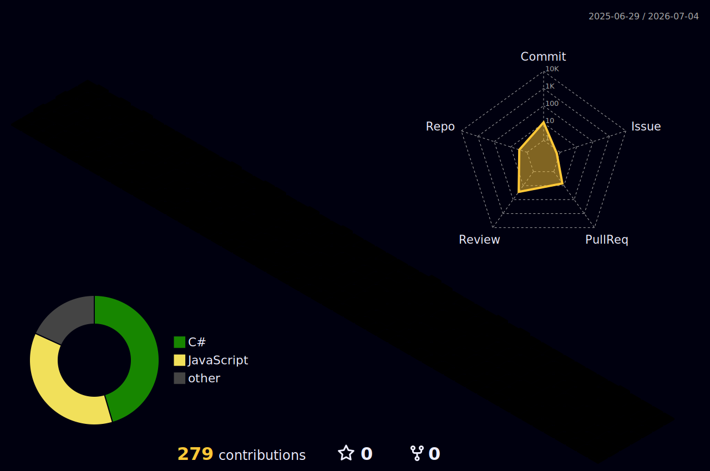

<h1 align="center">Hi 👋, I'm Dinesh Kumar</h1>

  

  

---

### 🧑‍💻 About Me

- 🌱 A **Junior Developer** — *building today, learning always.*
- 💻 Focused on **C# / .NET** desktop development with **WPF**.
- 🤝 Open to collaborating and always up for learning something new.

---

### 🛠️ Tech Stack

  
   
  

---

### 📊 GitHub Stats

  
  

  

  

---

### 🚀 Featured Projects

  
  

---

### 📈 Metrics

<!--
  This detailed metrics image is generated by the lowlighter/metrics GitHub Action.
  It commits an SVG to  github-metrics.svg  in this repo.
  See the workflow file:  .github/workflows/metrics.yml
  REQUIRED SETUP: create a Personal Access Token (classic) with  repo ,  read:org
  and  read:user  scopes, then add it as a repo secret named  METRICS_TOKEN .
  (The  repo  and  read:org  scopes let metrics show your work in organization
  repositories such as  metamation/Flux .)
  Also enable Settings -> Profile -> "Include private contributions on my profile"
  so private commits are counted.
  The image below stays blank until the Action runs for the first time
  (trigger it manually from the Actions tab, or wait for the daily schedule).
-->

  

---

### 🧊 Contributions

<!--
  This isometric graph is generated by the github-profile-3d-contrib GitHub Action.
  It commits an SVG to  profile-3d-contrib/profile-night-rainbow.svg  in this repo.
  See the workflow file:  .github/workflows/profile-3d.yml  (created alongside this README).
  The image below stays blank until the Action runs for the first time
  (trigger it manually from the Actions tab, or wait for the daily schedule).
-->

  

