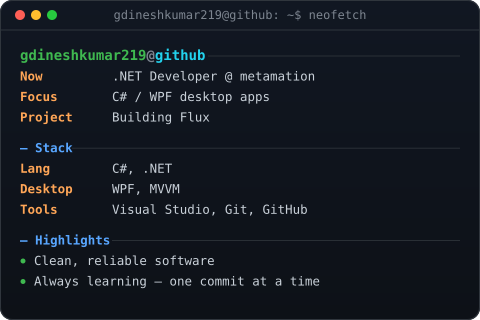

<h1 align="center">
  Dinesh Kumar
</h1>

  

  I build clean, reliable desktop applications with <strong>C# and WPF</strong>. 
  Currently working on <strong>Flux</strong> at
  <a href="https://github.com/metamation">metamation</a>.

  <a href="https://github.com/gdineshkumar219?tab=repositories">Explore my repositories</a>

---

<!--
  Portrait: assets/dinesh-ascii.svg (scripts/prep_photo.py + scripts/make_ascii_svg.py).
  Profile: assets/info-card.svg (edit ROWS in scripts/make_info_card.py).
-->

<h3><code>dinesh@github ~ $ whoami</code></h3>

  
  

---

<h3><code>dinesh@github ~ $ ./stack.sh</code></h3>

  <picture>
    <source media="(prefers-color-scheme: dark)" srcset="https://skillicons.dev/icons?i=cs,dotnet,visualstudio,git,github&amp;theme=dark" />
    
  </picture>
   
  
  
  

---

<h3><code>dinesh@github ~ $ ./contributions.sh</code></h3>

  

  
Contribution snake

  

    <picture>
      <source media="(prefers-color-scheme: dark)" srcset="https://raw.githubusercontent.com/gdineshkumar219/gdineshkumar219/output/github-contribution-grid-snake-dark.svg" />
      
    </picture>
  

